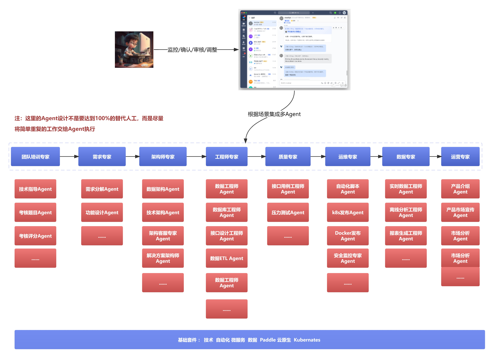

# 从需求到产品上线运营需要的专家服务列表

研究LLM和自动化结合的相关文章材料。

| 序号 | 类型 | 标题                                      | 状态   | 自媒体平台      |
|------|------|-------------------------------------------|--------|-----------------|
| 1    | 需求 | 在AIGC和数字中台的架构升级问题            | 已发布 | Wordpress/InfoQ |
|      |      |                                           |        |                 |
| 2    | 设计 | 对平台级产品重新规划设计思路              | 已发布 | Wordpress       |
| 3    |      | 超化研究上的全日志采集架构设计            | 已发布 | Wordpress       |
|      |      |                                           |        |                 |
| 4    | 研究 | 使用AIGC提升平台能力架构设计经验          | 已发布 | Wordpress       |
| 5    |      | 平台与AIGC交互的组件设计方案            | 已发布 | Wordpress       |
| 6    |      | 平台与AIGC交互的多Agent交互方案         | 已发布 | Wordpress       |
|      |      |                                           |        |                 |
| 7    | 提升 | 多角色Agent交互中感知记忆系统设计         | 设计中 |                 |
| 8    |      | 多角色Agent沙箱和自动执行系统设计         | 规划   |                 |
| 9    |      | 多角色Agent执行过程中的演化(反思)系统设计 | 规划   |                 |
|      |      |                                           |        |                 |
| 10   | 实践 | 超级工程师个体执行的落地方案设计          | 规划   |                 |
| 11   |      | 超级工程师个体实践过程中一些经验          | 规划   |                 |
|      |      |                                           |        |                 |
| 12   | 输出 | 服务批量生产自动化的设计思路              | 规划   |                 |
| 13   |      | 团队超自动化集成的一些思路与经验          | 未定   |                 |
| 14   |      | 阶段总结                                  |        |                 |
|      |      |                                           |        |                 |

#### 介绍
AIGC专家服务设计规划能力 

## 节点

1. 运维
- DevOps脚本专家：生成DevOps脚本
- Ansible脚本专家：生成Ansible自动化脚本
- Kubernetes专家：生成k8s部署脚本 

2. 营销
- 推广软文编写专家：生成软文用于产品推广，定时发布到各个媒体平台

3. 测试
- JUnit测试专家：？？是否有必要
- API测试专家：生成接口测试用例和数据

4. 开发
- 开发指导专家：
	- 提供开发过程的知识库指导查询和返回（类似于知识库）
	- 根据规范编写出对应的功能代码让开发直接复制
- 技术架构专家：
	- 针对不同的场景，生成不同的解决系统解决方案架构

5. 售前：
- 解决方案专家：针对业务场景整理出平台能处理的解决方案初版本，再进一步集成讨论

6. 产品

> 主要针对于[AIP智能设施超级自动化规划]的文档生成能力

7. 数据：
- 数据ETL迁移专家(离线/实时):
- 数据质量专家：生成检测脚本
- 数据挖掘专家：指标生成
- 数据报表展示：报表生成

8. 运营
- Bug分析专家：
- 需求分析专家：
 
